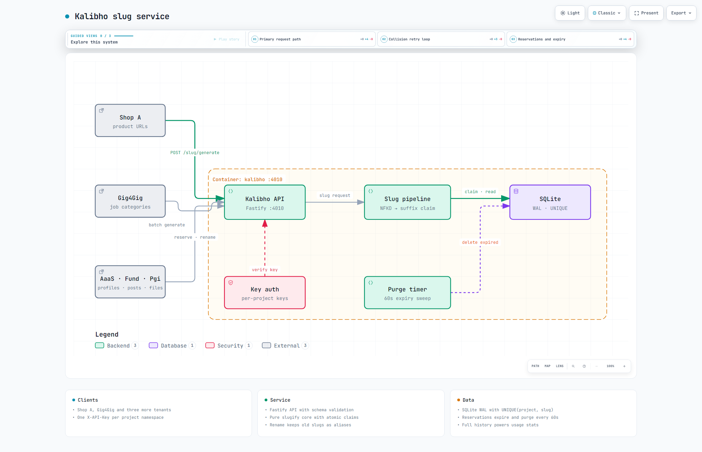

# Kalibho — Day 19

[](https://nodejs.org) [](https://fastify.dev) [](https://sqlite.org) [](https://www.docker.com)

**Local:** `http://localhost:4010` — `GET /` → `{"service":"Kalibho","version":"1.0.0",...}` | `GET /health` → `{"status":"ok",...}`

Centralized slug generation + collision checking. **Fastify + SQLite + Docker**. One slug engine for all 30 services: generate once, use everywhere, never collide.

> **Docs:** [Interactive Architecture](docs/architecture.html) • [Project Overview](docs/1.%20Project%20Overview.md) • [Architecture](docs/2.%20Architecture%20Overview.md) • [Workflows](docs/3.%20Workflow%20Overview.md) • [Deep Dive](docs/4.%20Deep%20Dive) • [TDS](Kalibho.md)

## Architecture — Interactive + Big Preview

[](docs/architecture.html)

> **Big preview** (2048×1320 light — 161 KB) — click for interactive pan/zoom/trace + light/dark + PNG export. Also available: [dark variant](docs/architecture.visual-check.2048x1320.dark.png) & [1440×900 light](docs/architecture.visual-check.1440x900.light.png). Full showcase: 9/9 checks, 0 errors.

## Stack
- **Runtime:** Node.js 20+ (ES modules)
- **Framework:** Fastify 4 (schema validation + `preHandler` auth hook)
- **DB:** SQLite via `better-sqlite3@12` (WAL mode, `UNIQUE(project_id, slug)` atomicity)
- **Unicode:** native `String.normalize('NFKD')` — zero extra deps
- **Auth:** `X-API-Key` header → `projects` table (multi-tenant)

## Project Structure
```
.
├── src/server.js                # Fastify wiring, route order, purge timer
├── src/config.js                # env-driven config (port, TTLs, limits)
├── src/db.js                    # all SQL: claims, reserve, rename, history, stats
├── src/migrate.js / src/seed.js # idempotent schema + Shop A / Gig4Gig keys
├── src/slug/slugify.js          # pure title → base slug (NFKD, no I/O)
├── src/slug/generator.js        # project policy + batch loop
├── src/slug/strategies.js       # suffix / timestamp / uuid catalog
├── src/routes/                  # generate, check, reserve, rename, resolve, history
├── src/middleware/auth.js       # X-API-Key → request.project
├── migrations/0001_init.sql     # projects + slugs + slug_history + indexes
├── test/slugify.test.js         # 11 pure-function unit tests
├── test/api.test.js             # 10 API tests via inject (isolated test DB)
├── Dockerfile                   # node:20-slim + python3/make/g++ (better-sqlite3 build)
├── docker-compose.yml           # :4010 + kalibho_data volume
├── docs/architecture.html       # interactive diagram (copy of root HTML)
├── Kalibho.md                   # TDS v1.0.0
└── README.md
```

## Quick Start (10 mins)

```bash
# 1. Install
npm install

# 2. Migrate (idempotent)
npm run migrate

# 3. Seed tenants
npm run seed
# → Shop A: shop-a-kalibho-key-2026 (suffix, 80)
# → Gig4Gig: gig4gig-kalibho-key-2026 (timestamp, 60)

# 4. Run
npm start
# → http://localhost:4010 (health: GET /health)

# 5. Test
npm test
# → 21 tests (11 slugify + 10 API)

# OR via Docker:
docker compose up -d --build
docker compose exec kalibho node src/seed.js   # volume starts empty: required once
curl http://localhost:4010/health
```

## API

All JSON. Base: `http://localhost:4010` — every `/slug/*` route needs `X-API-Key`. Full semantics in [docs/4. Deep Dive/API Routes.md](docs/4.%20Deep%20Dive/API%20Routes.md)

### POST /slug/generate
```json
{ "title": "Wireless Headphones Pro Max", "target_type": "product", "strategy": "suffix" }
```
`200` → `{ slug, base_slug, collision, attempts }` | `400` bad input | `401` bad key

### POST /slug/generate/batch
```json
{ "items": ["Wireless Headphones", { "title": "Café Déjà Vu", "strategy": "uuid" }] }
```
`200` → `{ total, succeeded, results: [{ success, slug | error }] }` | `400` over 100 items

### GET /slug/check/:slug
`200` → `{ available, existing? }` — always 200, never 404

### POST /slug/reserve
```json
{ "slug": "summer-sale-2026", "ttl_seconds": 1800 }
```
`200` → `{ reserved_until, ttl_seconds }` | `409` slug taken

### DELETE /slug/reserve/:slug
`200` → `{ message: "Reservation released" }` | `404` no reservation (spec alias `DELETE /slug/:slug/reserve` also works)

### PUT /slug/:slug/rename
```json
{ "new_slug": "premium-wireless-headphones" }
```
`200` → `{ old_slug, new_slug }` (old becomes alias) | `400` same/not-canonical | `404` missing | `409` target taken

### GET /slug/:slug ⭐ (for other services)
`200` → canonical `{ is_canonical: true, target_type, target_id, metadata }` or alias `{ is_canonical: false, redirect_to, canonical }` | `404` unknown

### GET /slug/history , GET /slug/stats , GET /slug/strategies
History: `?operation=&status=&search=&limit=&offset=` → `{ entries, pagination }` — Stats: `?days=` → `{ total_operations, collisions, collision_rate_percent, by_operation, active_slugs, alias_count }`

### GET / , GET /health
Index of endpoints + health check → `{ status: "ok" }`

## Testing (cURL) — Local

```bash
BASE="http://localhost:4010"
KEY="shop-a-kalibho-key-2026"

# generate
curl -X POST $BASE/slug/generate -H "X-API-Key: $KEY" -H "Content-Type: application/json" \
  -d '{"title":"Wireless Headphones Pro Max"}'
# → {"slug":"wireless-headphones-pro-max","collision":false,...}

# collision (same title again → -2)
curl -X POST $BASE/slug/generate -H "X-API-Key: $KEY" -H "Content-Type: application/json" \
  -d '{"title":"Wireless Headphones Pro Max"}'

# check
curl "$BASE/slug/check/wireless-headphones-pro-max" -H "X-API-Key: $KEY"

# batch
curl -X POST $BASE/slug/generate/batch -H "X-API-Key: $KEY" -H "Content-Type: application/json" \
  -d '{"items":["Wireless Headphones","Bluetooth Speaker","Wired Earphones"]}'

# reserve → conflict → release
curl -X POST $BASE/slug/reserve -H "X-API-Key: $KEY" -H "Content-Type: application/json" \
  -d '{"slug":"summer-sale-2026","ttl_seconds":1800}'
curl -X DELETE $BASE/slug/reserve/summer-sale-2026 -H "X-API-Key: $KEY"

# rename → resolve alias
curl -X PUT $BASE/slug/wireless-headphones-pro-max/rename -H "X-API-Key: $KEY" \
  -H "Content-Type: application/json" -d '{"new_slug":"premium-wireless-headphones"}'
curl "$BASE/slug/wireless-headphones-pro-max" -H "X-API-Key: $KEY"
# → {"is_canonical":false,"redirect_to":"premium-wireless-headphones",...}

# stats
curl "$BASE/slug/stats?days=30" -H "X-API-Key: $KEY"
```

## Integration (for Shop A, Gig4Gig, AaaS, Emerge Fund)

1. `POST {KALIBHO_URL}/slug/generate` with `X-API-Key`, `{ title, target_type, target_id, metadata }`
2. Use returned `slug` in your product URL / profile URL / file name
3. On rename: `PUT /slug/{old}/rename` — old URL keeps working via `redirect_to`
4. To resolve: `GET /slug/{slug}` — follow `redirect_to` when `is_canonical: false`

```typescript
const slugRes = await fetch(`${env.KALIBHO_URL}/slug/generate`, {
  method: 'POST',
  headers: { 'X-API-Key': env.KALIBHO_API_KEY, 'Content-Type': 'application/json' },
  body: JSON.stringify({ title, target_type: 'product', metadata: { category, price } }),
});
const { slug } = await slugRes.json();
```

## Security Notes

- Multi-tenant isolation: `UNIQUE(project_id, slug)` — Shop A slugs never collide with Gig4Gig
- Auth: per-project API keys, `is_active` flag revokes instantly; missing/invalid → `401`
- No key in code: keys live in SQLite seed + `.env`, never in git (`.gitignore` covers `data/*.db*`)
- Concurrency: uniqueness enforced by SQLite constraint, not app memory — safe across processes
- Input: Fastify JSON-schema on write routes (title 1–500, batch ≤100, TTL 60–86400); `new_slug` re-slugified server-side

### Ponytail decisions (skipped → when to add)
- No slugify library — native NFKD + regex is shorter and exact; add when non-Latin edge cases demand it
- No ORM/query builder — `better-sqlite3` prepared statements only; add when query count explodes
- No Redis/cache — SQLite WAL resolves in <1 ms; add when reads exceed single-file throughput
- No refresh-style token rotation — N/A (API keys); add per-key expiry when revocation needs TTL
- No `better-sqlite3@9` — has no Node 20.20 prebuilt; pinned `@12` + slim image with build tools

## Deploy Checklist

- [ ] `npm install` clean (or `docker compose up -d --build` succeeds)
- [ ] `npm run migrate` + `npm run seed` (or `docker compose exec kalibho node src/seed.js` for the volume)
- [ ] `GET /health` → `{"status":"ok"}`
- [ ] Generate → collision (`-2`) → check → reserve → rename → resolve-alias flow passes
- [ ] `npm test` → 21/21 green
- [ ] Share base URL + API key with consuming service

## License
MIT — reuse for all 30 services.
