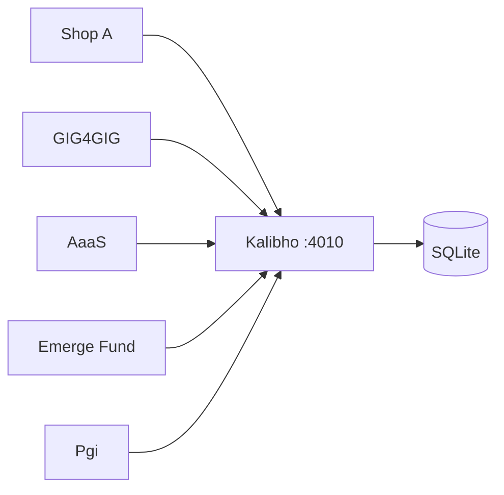
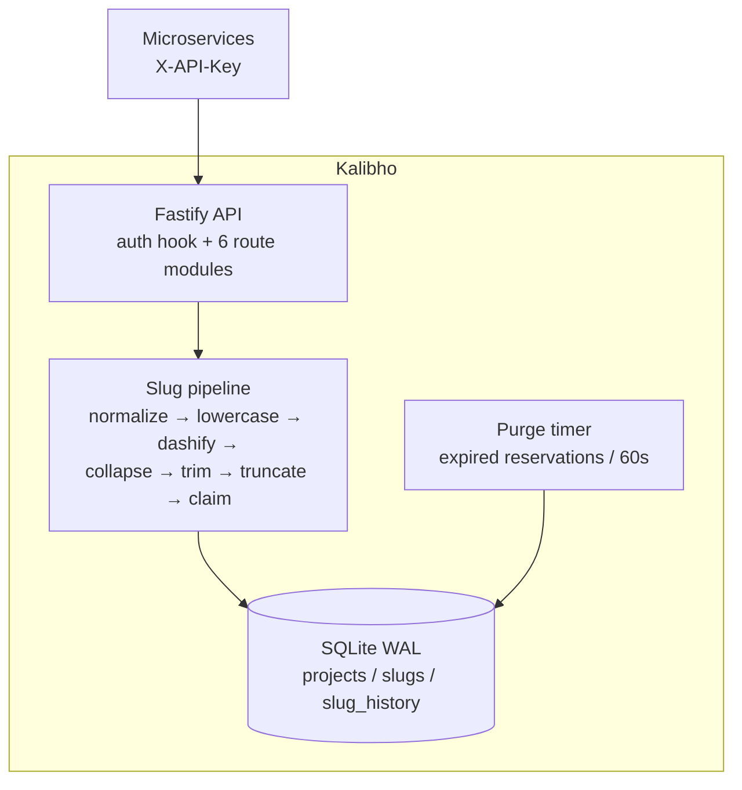
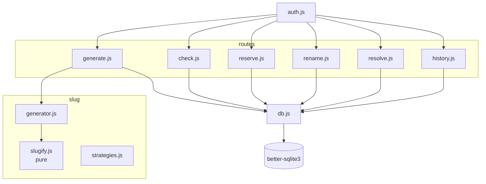

# Architecture overview: Kalibho

## System context (C4 level 1)

All callers authenticate with `X-API-Key`. Responses are JSON. There are no outbound
dependencies. Kalibho is a leaf service with no outbound calls.

## Container (C4 level 2)

Single Node process, single SQLite file. Concurrency safety comes from the database,
not the application layer.

## Component (C4 level 3)

Route registration order matters: `GET /slug/:slug` (resolve) is registered **before**
history routes in code but Fastify matches static segments first. Resolve is still
deliberately registered last among `/slug/*` modules with a comment, and release uses
`DELETE /slug/reserve/:slug` (plus a compat alias for the spec's
`DELETE /slug/:slug/reserve`) so no route is shadowed.

## Architectural patterns

- **Pure core, impure shell**: `slugify()` has no DB dependency; `claimSlugAtomic()`
  owns all side effects. Unit-testable without I/O.
- **Constraint-driven uniqueness**: `UNIQUE(project_id, slug)` + INSERT-or-catch is the
  lock. No in-memory mutex, works across processes.
- **Alias-preserving rename**: transactional INSERT new canonical + demote old row to
  `is_canonical = 0, canonical_slug = new`. Redirects survive renames.
- **Reservation as row, not flag**: TTL rows are deleted on expiry/release, so a
  reservation never blocks a slug forever.

## Key design decisions

| Decision | Rationale |
|---|---|
| NFKD + strip `\u0300–\u036f`, keep `\p{L}` | `café` → `cafe`, non-Latin input still works |
| Truncate at word boundary (>60% mark) | avoids `wireless-headpho` |
| Suffix default, timestamp fallback after 100 tries | human-readable `-2`, no infinite loops |
| SQLite WAL + foreign keys | fast lookups, per-project cascade |
| `node:20-slim` + `python3/make/g++` in image | `better-sqlite3@12` has no Node-20.20 prebuilt; source build always works |
| Purge timer `unref()`d | `node --test` exits cleanly |

## Module breakdown

- **`src/slug/`**: pure slug math. No imports from `db.js` except via `generator.js`.
- **`src/db.js`**: all SQL. Projects, slug CRUD, atomic claims, reserve/release,
- **`src/routes/`**: one file per concern; Fastify JSON-schema validation on
  write endpoints; every mutating op logs to `slug_history`.
- **`src/middleware/auth.js`**: 401 on missing/invalid key, attaches
  `request.project` (carries `max_slug_length`, `collision_strategy`).
