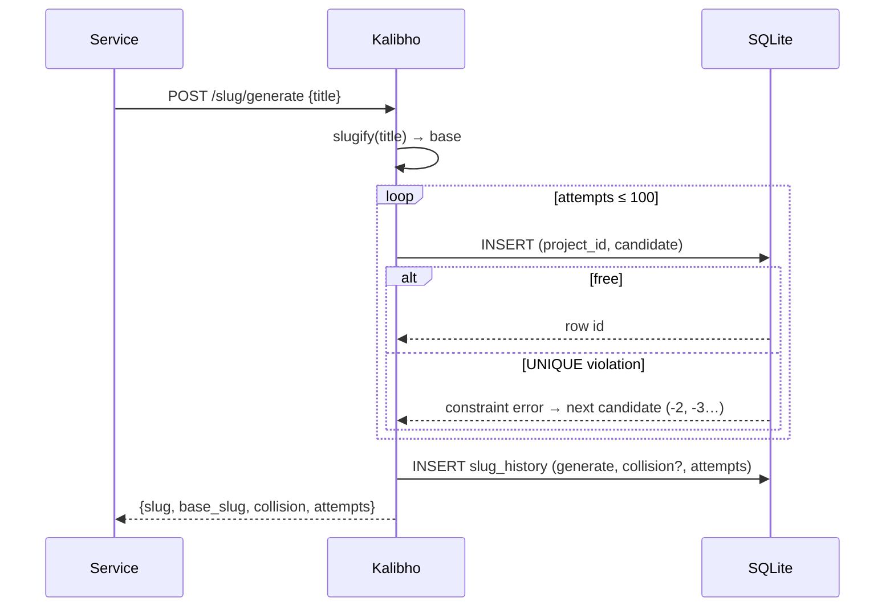
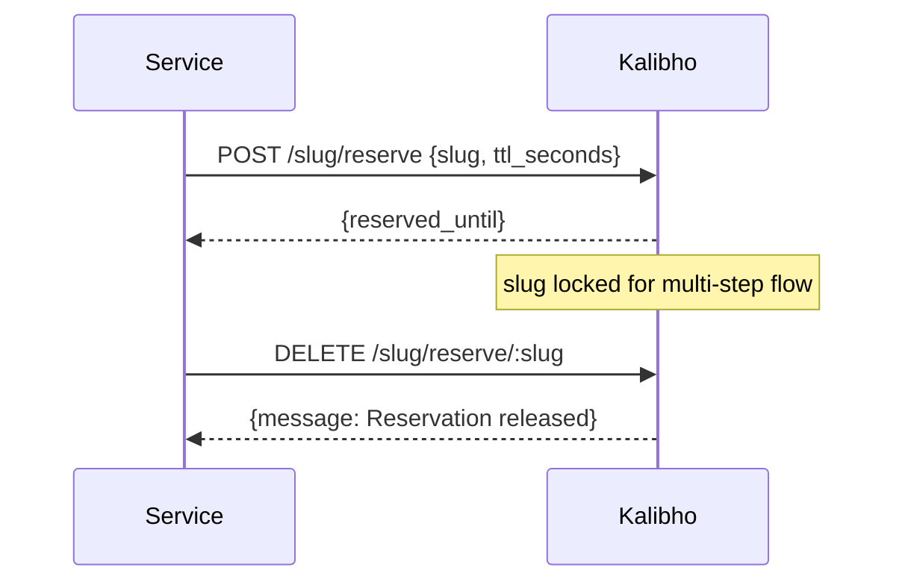
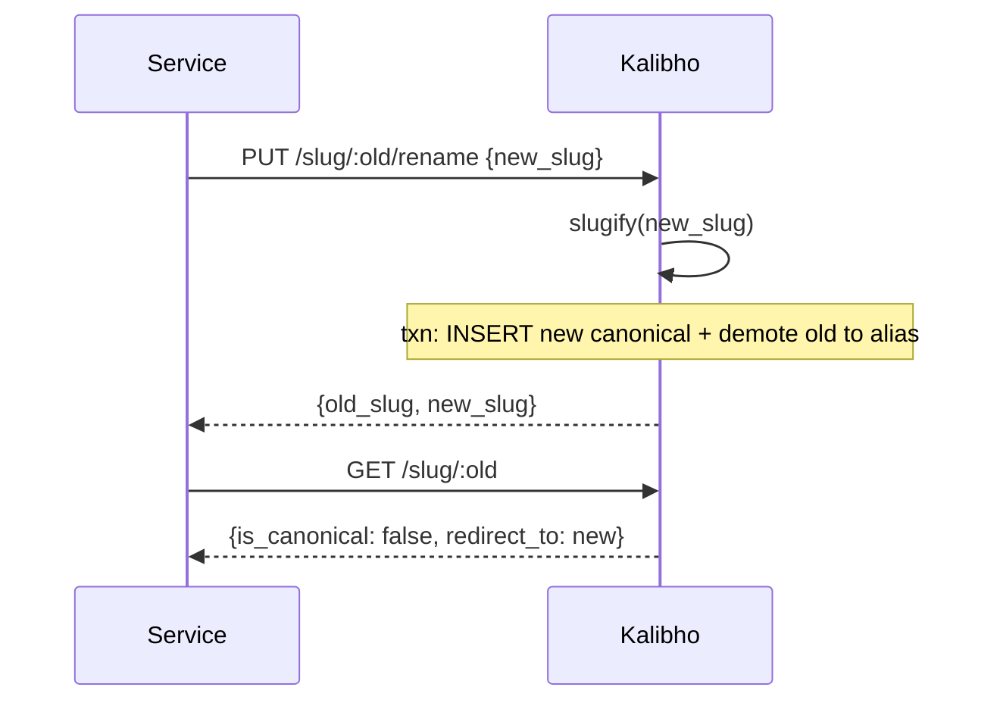

# Workflow overview: Kalibho

## Generate (with collision)

1. Normalize title → base slug (pure function).
2. Try base, then `-2`, `-3`… (or timestamp/uuid suffixes).
3. First successful INSERT wins. It is atomic across concurrent callers.
4. Past 100 attempts, fall back to timestamp+random suffix (never loops forever).

## Batch generate

Single `POST /slug/generate/batch` (≤100 items, mixed strings/objects) loops
`generateUniqueSlug` per item and returns per-item `{success, slug | error}` plus
`{total, succeeded}`. One history row records the batch.

## Reserve, use, release

Expired reservations are reclaimed on re-reserve and purged every 60s. Reserving a
taken slug returns `409 slug_taken`.

## Rename with alias and resolve

Renaming a non-canonical (alias) row is rejected (`400 not_canonical`); renaming onto
a taken slug is `409 new_slug_taken`.

## History and stats

- `GET /slug/history?operation=&status=&search=&from_date=&to_date=&limit=&offset=`
  → `{entries, pagination}`.
- `GET /slug/stats?days=` → `{total_operations, collisions,
  collision_rate_percent, avg_duration_ms, by_operation, active_slugs, alias_count}`.

## Error handling

| Case | Status |
|---|---|
| Missing / invalid `X-API-Key` | 401 |
| Schema violation (title length, batch size…) | 400 (Fastify) |
| Reserve taken / rename target taken | 409 |
| Unknown slug, released reservation, rename source | 404 |
| Generation failure | 500 + history row with `status: failed` |

Failed `reserve`/`rename` attempts are also logged to history with `status: failed`.
