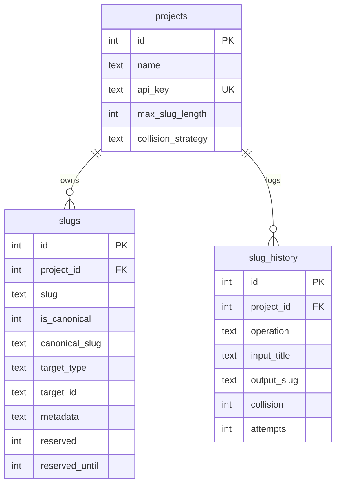

# Deep Dive: Storage (`migrations/`, `src/db.js`)

## Database schema

`UNIQUE(project_id, slug)` is the entire concurrency model. Indexes cover
`(project_id, slug)`, `(project_id, canonical_slug)`, `(project_id, target_type,
target_id)`, `(reserved, reserved_until)`, and history query axes.

## Key operations

- **Claim** (`claimSlugAtomic`): build candidate, `INSERT`, catch `UNIQUE` errors
  only (anything else rethrows), repeat. Returns `{slug, collision, attempts, id}`.
- **Reserve**: `INSERT` a `reserved` row; on `UNIQUE`, reclaim only if
  `reserved_until < now`, else `{success: false, reason: 'slug_taken'}`.
- **Release / purge**: `DELETE` reserved rows by slug or by expiry.
- **Rename**: one transaction: `INSERT` new canonical (carrying `target_type/id`),
  then demote old row to alias. Guards: source must exist and be canonical; target
  must be free.
- **History**: `logHistory` on every generate/check/reserve/rename (success and
  failure); `listHistory` filters + paginates; `getStats` aggregates collision rate,
  avg duration, per-operation counts, active/alias totals.

## Connection management

`getDatabase()` is a singleton: resolves `DATABASE_PATH` relative to the project
root, creates `data/`, enables WAL + foreign keys, runs `0001_init.sql`
(idempotent `IF NOT EXISTS`). Importing `db.js` never connects: the first call does.

## Environment variables

| Var | Default | Used for |
|---|---|---|
| `DATABASE_PATH` | `./data/kalibho.db` | SQLite file (Docker: `/app/data/kalibho.db` volume) |
| `DEFAULT_MAX_SLUG_LENGTH` | `80` | per-project overridable |
| `DEFAULT_COLLISION_STRATEGY` | `suffix` | per-project overridable |
| `DEFAULT_COLLISION_MAX_ATTEMPTS` | `100` | claim loop bound |
| `DEFAULT_RESERVATION_TTL_SECONDS` / `MAX_…` | `600` / `86400` | reserve TTL clamp |
| `MIN/MAX_TITLE_LENGTH`, `MAX_BATCH_SIZE` | `1` / `500` / `100` | validation |
| `PURGE_EXPIRED_RESERVATIONS_INTERVAL_MS` | `60000` | purge timer |
